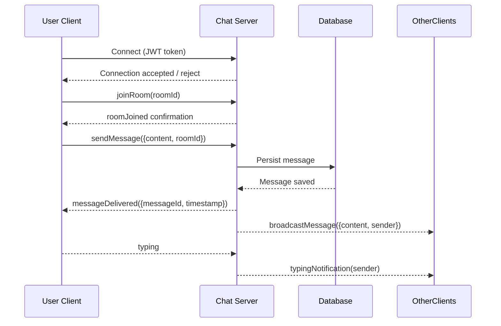

# Chat Application (Full-Stack | Real-Time Messaging)

🔗 [GitHub Repo](https://github.com/COZYTECH/Chat-Application)

A **scalable real-time chat platform** built with **Node.js, WebSockets, and React/React Native**. Designed with **presence tracking, typing indicators, optimistic UI, reconnect logic, and horizontal scalability** in mind.

---

<p align="center">
  
</p>

---

## 🚀 Executive Summary

This project demonstrates **senior-level backend and full-stack engineering** patterns for real-time systems:

* WebSocket-driven real-time messaging
* Presence and typing indicators
* Optimistic UI & client-side reconciliation
* Reconnect and missed message sync
* Layered architecture for scalability and maintainability
* Production-oriented error handling & security

---

## 🧠 Architecture Overview

### WebSocket Event Flow

* Clients connect with JWT tokens
* Subscribe to rooms and events (`joinRoom`, `message`, `typing`)
* Server validates, persists (to DB), and broadcasts events
* Client updates UI optimistically and reconciles with server

---

### 📊 Sequence Diagram: Message Flow



---

### 📐 Architecture Diagram


> **Description:**
>
> * Clients (Web/Mobile) → WebSocket → Node.js server
> * Server handles messages, presence, typing indicators
> * Database for message persistence
> * Redis adapter for horizontal scaling
> * Event flows: `joinRoom`, `message`, `typing`, `disconnect`

---

## 🛠 Core Features

### 🔑 Real-Time Presence & Typing

* Online/offline tracking
* Typing indicators broadcast to room participants
* Reconnection sync for transient network issues

### 💬 Messaging Reliability

* Optimistic UI for instant feedback
* Guaranteed delivery when connected
* Broadcast to room participants
* Message acknowledgment from server

### 🔄 Reconnect & Sync

* Automatic room rejoin
* Missed message reconciliation
* Presence and typing state sync
* Minimal duplicate events

---

## 🔧 Client SDK Example (JavaScript)

```javascript
import io from "socket.io-client";

const socket = io("http://localhost:5001", {
  auth: { token: "JWT_TOKEN_HERE" },
});

socket.on("connect", () => {
  console.log("Connected:", socket.id);
  socket.emit("joinRoom", { roomId: "room123" });
});

socket.on("message", (data) => console.log("New message:", data));

socket.emit("message", { content: "Hello everyone!", roomId: "room123" });
socket.emit("typing", { roomId: "room123" });
```

---

## 🔧 REST API / Postman Example

**Login**

```
POST /api/auth/login
Content-Type: application/json

{
  "email": "user@example.com",
  "password": "password123"
}
```

**Response**

```json
{
  "token": "JWT_TOKEN_HERE",
  "user": { "id": "userId123", "name": "John Doe" }
}
```

**Additional REST endpoints**

* GET `/api/users/:id`
* GET `/api/rooms/:roomId`
* POST `/api/rooms`

These integrate with WebSocket subscriptions.

---

## 📦 Tech Stack

**Backend**

* Node.js + Express
* WebSockets + Socket.IO
* JWT Authentication

**Frontend**

* React / React Native
* Context API / Redux
* WebSocket client abstraction

**Infrastructure**

* Redis adapter (scaling)
* PM2 / Cluster mode
* Nginx (WebSocket proxy)

---

## ⚙ Environment Setup

```
PORT=5001
JWT_SECRET=your_secret
WS_ORIGIN=http://localhost:3000
```

---

## 🚀 Local Development

```bash
git clone https://github.com/COZYTECH/Chat-Application
cd Chat-Application
npm install
npm run dev
```

Server runs at: `ws://localhost:5001`

---

## 🏗 Production Readiness

* Stateless design → cluster-ready
* Scoped event contracts
* Optimistic UI integration
* Presence & reconnect logic
* Layered service architecture
* Security & error handling

---

## ⏭ Future Enhancements

* Redis pub/sub for multi-instance scaling
* ACK/NACK message delivery
* Rate limiting / anti-spam
* Room history replay on reconnect
* Metrics & observability (Prometheus, Grafana)
* Type-safe event contracts (TypeScript)
* Docker + CI/CD pipelines

---

## 🔑 Engineering Decisions

* **WebSockets over polling:** for low-latency, bi-directional messaging
* **Layered architecture:** separates transport, business logic, DB
* **Ownership & presence validation:** enforces correct access and reliable UX

---

## 👤 Author

**Arigi Adinoyi Samuel**
Senior Backend & Full-Stack | DevOps Engineer
GitHub: [cozytech](https://github.com/cozytech)


